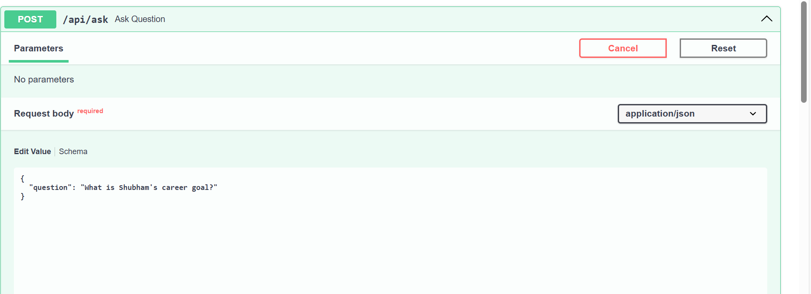
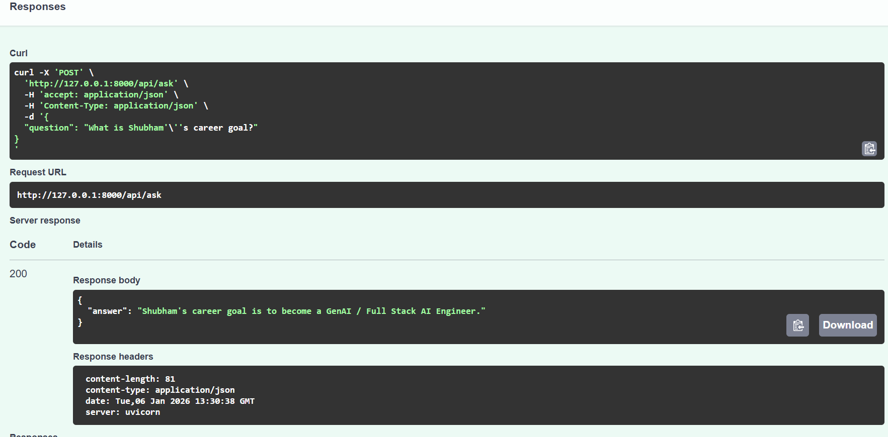
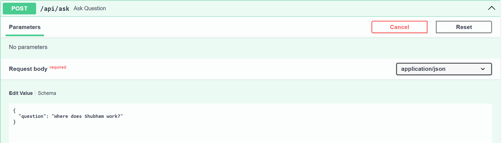
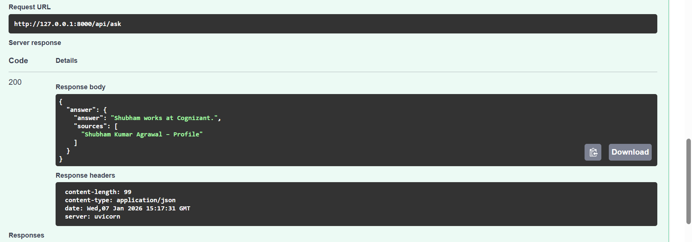

Trying to build a RAG project to understand how real GenAI systems work internally 
this will be our project name :"AI Business Operations Assistant"

Tech Stack (So Far):
Backend: FastAPI
LLM Provider: OpenAI (direct)
Embeddings: OpenAI text-embedding-3-large
Database: PostgreSQL
Vector Store: pgvector
ORM / DB Access: SQLAlchemy

we will try it step by step 

1 – We setup FastAPI Backend & OpenAI Integration :--->
        Set up a clean FastAPI backend structure.
        Created a proper project folder layout following production practices.
        Configured environment variables using .env (no secrets in code).
        Integrated OpenAI (direct API) using LangChain.
        Created a test API endpoint to verify LLM connectivity.
        Tested POST requests using Swagger UI.

    After completing these step now our : 
        Backend server is running correctly.
        Application can safely communicate with an LLM.
        The foundation is stable before adding databases or AI logic.   

2 – Setup the PostgreSQL + pgvector (RAG Foundation)  :--->
        Installed and configured PostgreSQL locally.
        Enabled the pgvector extension for vector similarity search.
        Designed a production-ready database schema:
            documents table for raw documents
            document_embeddings table for vectorized chunks
        Set up SQLAlchemy session management using session.py.
        Verified database connection from Python.
        Manually tested inserts and reads from the database. 

    After completing these steps we have now :
        PostgreSQL connected to backend
        pgvector enabled and working
        Vector schema ready for embeddings          

3 – Document Ingestion , Embeddings & Chunking  (Starting our RAG)
        Implemented text chunking using a recursive splitter.
        Integrated OpenAI embeddings (text-embedding-3-large).
        Built a complete document ingestion pipeline:
            Raw text → chunks
            Chunks → embeddings
            Embeddings → stored in pgvector
        Created /api/ingest endpoint to add documents dynamically.
        Tested ingestion with a personal profile document.
        Verified data directly in PostgreSQL tables.

    After these steps we aheve: 
        Documents stored successfully
        Embeddings generated and saved
        RAG knowledge base working end-to-end   

4 - Similarity Search & RAG Question Answering
        Implemented vector similarity search using pgvector to find the most relevant document chunks.
        Converted user questions into embeddings and matched them against stored document embeddings.
        Built a RAG (Retrieval-Augmented Generation) pipeline that:
            Retrieves top-K relevant chunks from the database
            Injects them as context into the LLM prompt
            Forces the model to answer only from retrieved context
        Created a new API endpoint /api/ask for asking questions over ingested documents.
        Successfully tested question answering using personal profile data stored in the database.       

    After these steps we have: 
        Ingest documents dynamically
        Convert them into embeddings
        Store them in a vector database
        Retrieve relevant context using similarity search
        Answer user questions using RAG without hallucination    

##  Question Answering API – Input & Output

5 - Added document-level citation
        Enhanced the retrieval layer to return document titles along with content chunks.
        Implemented citations so each answer includes the source document(s) used.
        Updated the RAG pipeline to generate explainable answers, improving trust and reliability.
        
    After these step we have
        Answers which include document sources
        Retrieval joins document metadata correctly
        RAG responses are explainable   

##  Question Answering API – Input & Output

